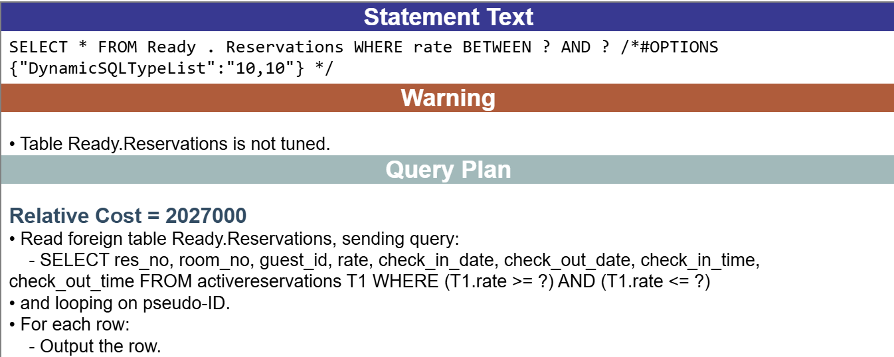
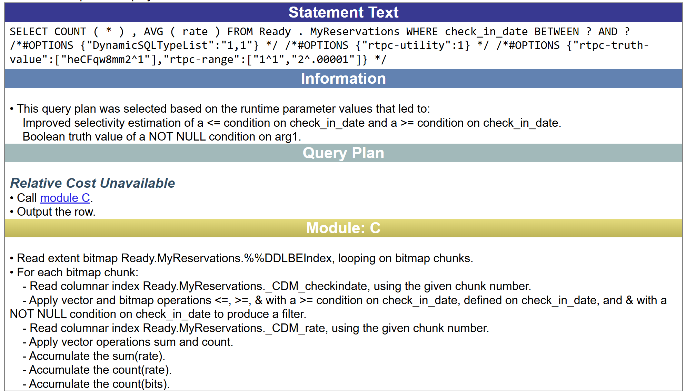

# Overview demo of new 2025.1 features

This demo scenario covers a range of new SQL capabilities in the InterSystems IRIS Data Platform 2025.1 release. Some of these were released as part of the 2024.2 and 2024.3 Continuous Delivery releases, and now have rolled into the Extended Maintenance stream.


## Foreign Tables

Lots of new things on Foreign Tables this year, including full privilege support, a new `THROUGH SERVER` command, and the capability as a whole levelling up from an experimental feature into a fully production-supported feature.

```SQL
-- create foreign server representing our MySQL database
CREATE FOREIGN SERVER Ready.MySQL
    FOREIGN DATA WRAPPER JDBC
    CONNECTION 'MySQL'
    NODELIMITEDIDS;

-- create a foreign table based off a table in the remote server
CREATE FOREIGN TABLE Ready.Reservations
    SERVER Ready.MySQL
    TABLE 'activereservations';

-- now we'll create a demo user to show you more about the new privileges for foreign tables
CREATE USER ready2025 IDENTIFIED BY "alreadyready";

GRANT SELECT ON SCHEMA Ready TO ready2025;
GRANT USE ON SERVER Ready.MySQL TO ready2025;

-- for admin users, there's a new %MANAGE_FOREIGN_SERVER admin privilege to govern exactly that
CREATE USER admin2025 IDENTIFIED BY "alreadyready";
GRANT %MANAGE_FOREIGN_SERVER, %CREATE_TABLE, %DROP_TABLE TO admin2025;

```

If you want to see more examples of how to create foreign servers and tables, check out [this demo repository](https://github.com/mgoldenisc/isc-resort-demo), which we've gratuitously borrowed (forked) from here. In fact, if you're running this using Docker, you can probably just open the corresponding [Jupyter notebook](http://localhost:8888/lab/tree/demo.ipynb).


## `LOAD SQL`

2025.1 also introduces a neat new capability to run entire scripts from the SQL prompt. We already had an ObjectScript API for this, but it was a little impractical for SQL-focused users, and not all that convenient with respect to capturing output for the commands in the script. 

We've put the sample commands above in a `foreign-server-demo.sql` file to show how this works:

```SQL
LOAD SQL FROM FILE '/opt/irisbuild/src/foreign-server-demo.sql'
	DELIMITER ';'
	VERBOSE;
```

The output of all commands in your script are logged to the `%SQL_Diag` tables, which you may already be familiar with if you've used the `LOAD DATA` command before. You can query those through SQL, or use the straightforward interface in the [System Management Portal](http://localhost:42773/csp/sys/UtilHome.csp) for browsing the results:

[image]

## More on Foreign Tables

Now that we've created our foreign server and table, let's take a look at what we can do with them. Of course, there's the foreign table projecting from MySQL itself, which we can now conveniently query from the IRIS side:

```SQL
SELECT * FROM Ready.Reservations WHERE rate BETWEEN 400 AND 500;
```
This returns results from MySQL as expected. Let's take a look at what exactly gets sent over to the foreign server by looking at the query plan:

```SQL
EXPLAIN SELECT * FROM Ready.Reservations WHERE rate BETWEEN 400 AND 500;
```

That's a little terse, but formatted using the System Management Portal, you'd see the following:



As you can see, this shows the exact statement that was sent to the remote server. In this case, the range condition got pushed down to MySQL, limiting the data that needs to be sent over the wire back to IRIS. This is called "predicate pushdown" and something we continue to enhance in upcoming releases to include more of the `WHERE` clause, as well as aggregation and sorting clauses from your query.

Note another nice new feature of IRIS 2025.1: additional information and warning messages that can help you adjust your query or schema to obtain a better query plan. This time it points out that the table has no statistics (which is somewhat moot for a foreign table), but it may also show you information about indices that might be disabled, advice on the use of collations, and feedback on the use of Runtime Plan Choice.

## Exploring foreign servers directly

Now, let's assume we're starting from a clean sheet and didn't have our foreign table yet, and needed to check out what's on the foreign server. Or, perhaps we want to use some syntax that's specific to the remote server. You can now do this using the `THROUGH` command, new in IRIS 2024.2, which will forward your statement to the remote server verbatim:

```SQL
THROUGH SERVER Ready.MySQL
   SELECT DATE_FORMAT(check_in_date, '%b %y') as "Month" FROM activereservations;
```


## Table Conversions

Let's assume we want to do some local experimentation with the reservation dataset, taking a snapshot of all the reservations for June 2025. That's easy using the `CREATE TABLE .. AS SELECT` command, also known as CTAS.

```SQL
CREATE TABLE Ready.MyReservations AS
	SELECT * FROM Ready.Reservations 
	WHERE check_in_date BETWEEN '2025-06-01' AND '2025-06-30';
```

That command itself isn't new, but having a local copy allows us to show another new feature of IRIS 2025.1: the ability to convert table data between classic row and columnar layout. You can convert tables in their entirety, or select individual columns to convert.

```SQL
-- converting individual columns
ALTER TABLE Ready.MyReservations
    CONVERT COLUMN rate TO STORAGETYPE = COLUMNAR; 

-- converting the entire table
ALTER TABLE Ready.MyReservations 
	CONVERT TO STORAGETYPE = COLUMNAR;
```

Now you'll see that analytical queries like the following can take advantage of the columnar layout, dramatically speeding up response times on large datasets:

```SQL
SELECT COUNT(*), AVG(rate) 
  FROM Ready.MyReservations 
  WHERE check_in_date BETWEEN '2025-06-21' AND '2025-06-25'
```



The `ALTER TABLE .. CONVERT` commands may take time to complete when your table already has a lot of data in it, so we've made sure your table remains "online" while the command is executing. That means you can continue to query the table, and insert, update, or delete rows. See also the [documentation](https://docs.intersystems.com/irislatest/csp/docbook/DocBook.UI.Page.cls?KEY=RSQL_altertable#RSQL_altertable_convertcolumnar) for more syntax options.


## New pagination syntax

One more convenience we've added in this release is alternative syntax to page through result sets. We've always supported `SELECT TOP 123` style syntax, which SQL Server also uses, but other database platforms have used different flavours to achieve the same thing.

```SQL
-- classic IRIS & SQL Server syntax
SELECT TOP 10 res_no, room_no, rate, check_in_date, check_in_time
  FROM Ready.Reservations
  ORDER BY check_in_date, check_in_time;

-- using Postgres-style syntax
SELECT res_no, room_no, rate, check_in_date, check_in_time
  FROM Ready.Reservations
  ORDER BY check_in_date, check_in_time
  LIMIT 10 OFFSET 1;

-- using ANSI SQL standard syntax
SELECT res_no, room_no, rate, check_in_date, check_in_time
  FROM Ready.Reservations
  ORDER BY check_in_date, check_in_time
  OFFSET 1 FETCH 10;
```

## Selective SQL Auditing

Finally, let's look back at what we've done through the lens of the paranoid (or properly-security-educated) administrator. They may not care about each and every query we ran, but they would about what we'd have done in terms of DDL changing table structure, and possibly also DML that updated table data. 
You can now cover such fine-grained auditing policies in IRIS, selecting what to track per statement type.

[image]